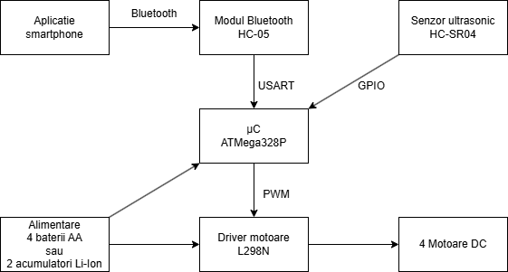

# Touring Car

A Bluetooth-controlled 4WD rover built on an ATmega328P, featuring autonomous obstacle avoidance and progressive motor acceleration.

## Demo

https://youtube.com/shorts/jJCe7olzHS4

## Features

- Remote control via Bluetooth from a smartphone app (4 directions)
- Autonomous obstacle avoidance: when an obstacle is detected within 15cm while moving forward, the car stops, reverses to a safe distance, scans left and right, and steers toward the clearer path
- Progressive acceleration on forward/backward movement
- Stable distance readings via averaged HC-SR04 measurements

## Hardware



| Component | Details |
|---|---|
| Microcontroller | ATmega328P Xmini Xplained |
| Chassis | 4WD kit (4 DC motors with gearboxes + 4 wheels) |
| Motor driver | L298N |
| Bluetooth module | HC-05 |
| Distance sensor | HC-SR04 |
| Power | 4× AA batteries → L298N 12V input (onboard regulator powers the rest at 5V) |

### Pinout

| Peripheral | ATmega328P Pin | Peripheral Pin | Direction |
|---|---|---|---|
| HC-05 | PD0 (RX) | TXD | Input |
| HC-05 | PD1 (TX) | RXD | Output |
| HC-SR04 | PD2 | Trig | Output |
| HC-SR04 | PD3 | Echo | Input |
| L298N | PD5 | IN1 | Output |
| L298N | PD6 | IN2 | Output |
| L298N | PB1 | IN3 | Output |
| L298N | PB2 | IN4 | Output |

## Software

**Environment:** PlatformIO (VS Code)  
**Language:** C++ (Arduino framework)

### Key constants

```cpp
const int CRASH_THRESHOLD = 15;  // cm — triggers autonomous evasion
const int SAFE_DISTANCE    = 30;  // cm — evasion ends when cleared
const int MIN_SPEED        = 130; // PWM — minimum speed motors respond to
const int MAX_SPEED        = 255; // PWM — full speed
const int ACCEL_STEP       = 15;  // PWM units added per acceleration tick
const int ACCEL_DELAY_MS   = 20;  // ms between acceleration ticks
```

### Architecture

The firmware is built around a simple state machine driven by `currentCommand`, which holds the last valid Bluetooth command received (`F`, `B`, `L`, `R`, `S`).

Each `loop()` iteration:
1. Checks `serialEvent()` for a new Bluetooth command (handled via UART RX interrupt internally)
2. Reads a stable distance from the HC-SR04 (average of 3 readings)
3. Triggers autonomous evasion if moving forward and obstacle is too close, otherwise executes the current command

Acceleration is implemented non-blocking using `millis()` — speed ramps from `MIN_SPEED` to `MAX_SPEED` in ~180ms on forward and backward movement. Turning uses full speed directly.

## Bluetooth Commands

| Character | Action |
|---|---|
| `F` | Forward |
| `B` | Backward |
| `L` | Turn left |
| `R` | Turn right |
| `S` | Stop |

## Building & Flashing

```bash
# Build
pio run

# Upload
pio run --target upload
```
